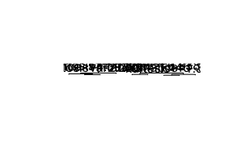

fake-banknotes
================
Amanda Efendi & Nina Kumagai
07/09/2019

``` r
# rmarkdown::word_document
```

# 1\. Loading the data

``` r
df = read.table("data_banknote_authentication.txt",
                  sep=",",
                  col.names=c("variance", "skew", "kurtosis", "entropy", "class"),
                  fill=FALSE, 
                  strip.white=TRUE)
```

# 2\. Data Wrangling

``` r
head(df)
```

    ##   variance    skew kurtosis  entropy class
    ## 1  3.62160  8.6661  -2.8073 -0.44699     0
    ## 2  4.54590  8.1674  -2.4586 -1.46210     0
    ## 3  3.86600 -2.6383   1.9242  0.10645     0
    ## 4  3.45660  9.5228  -4.0112 -3.59440     0
    ## 5  0.32924 -4.4552   4.5718 -0.98880     0
    ## 6  4.36840  9.6718  -3.9606 -3.16250     0

``` r
summary(df)
```

    ##     variance            skew            kurtosis          entropy       
    ##  Min.   :-7.0421   Min.   :-13.773   Min.   :-5.2861   Min.   :-8.5482  
    ##  1st Qu.:-1.7730   1st Qu.: -1.708   1st Qu.:-1.5750   1st Qu.:-2.4135  
    ##  Median : 0.4962   Median :  2.320   Median : 0.6166   Median :-0.5867  
    ##  Mean   : 0.4337   Mean   :  1.922   Mean   : 1.3976   Mean   :-1.1917  
    ##  3rd Qu.: 2.8215   3rd Qu.:  6.815   3rd Qu.: 3.1793   3rd Qu.: 0.3948  
    ##  Max.   : 6.8248   Max.   : 12.952   Max.   :17.9274   Max.   : 2.4495  
    ##      class       
    ##  Min.   :0.0000  
    ##  1st Qu.:0.0000  
    ##  Median :0.0000  
    ##  Mean   :0.4446  
    ##  3rd Qu.:1.0000  
    ##  Max.   :1.0000

``` r
#library(dlookr)
#describe_data = describe(df)
```

``` r
#Change class to factor
df$class <- as.factor(df$class); str(df)
```

    ## 'data.frame':    1372 obs. of  5 variables:
    ##  $ variance: num  3.622 4.546 3.866 3.457 0.329 ...
    ##  $ skew    : num  8.67 8.17 -2.64 9.52 -4.46 ...
    ##  $ kurtosis: num  -2.81 -2.46 1.92 -4.01 4.57 ...
    ##  $ entropy : num  -0.447 -1.462 0.106 -3.594 -0.989 ...
    ##  $ class   : Factor w/ 2 levels "0","1": 1 1 1 1 1 1 1 1 1 1 ...

``` r
#Rename the levels of class
levels(df$class) <- c("Fake", "Real"); str(df)
```

    ## 'data.frame':    1372 obs. of  5 variables:
    ##  $ variance: num  3.622 4.546 3.866 3.457 0.329 ...
    ##  $ skew    : num  8.67 8.17 -2.64 9.52 -4.46 ...
    ##  $ kurtosis: num  -2.81 -2.46 1.92 -4.01 4.57 ...
    ##  $ entropy : num  -0.447 -1.462 0.106 -3.594 -0.989 ...
    ##  $ class   : Factor w/ 2 levels "Fake","Real": 1 1 1 1 1 1 1 1 1 1 ...

# 3\. EDA on Data

``` r
# library(RColorBrewer)
# boxplot(df[,1:4], ylab='Values', main='Overview of BankNote Dataset', col=c(brewer.pal(4, "Spectral")))
```

``` r
library(DescTools)
plot(Desc(df)) 
```

<!-- --><!-- --><!-- --><!-- --><!-- -->

``` r
#hist(df)
```

``` r
plot(df)
```

<!-- -->

``` r
library(DataExplorer)
```

# 4\. Making TRAINING and TESTING subsets

``` r
make_train = function(seed_no){
  set.seed(seed_no)
  testIdx <- sample(1:nrow(df),floor(nrow(df)*0.2))
  training <- df[-testIdx,]
  return (training)
}
```

``` r
make_test = function(seed_no){
  set.seed(seed_no)
  testIdx <- sample(1:nrow(df),floor(nrow(df)*0.2))
  testing <- df[testIdx,]
  return (testing)
}
```

``` r
train1 = make_train(79)
test1 = make_test(79)

train2 = make_train(8)
test2 = make_test(8)

train3 = make_train(19)
test3 = make_test(19)

train4 = make_train(23)
test4 = make_test(23)

train5 = make_train(32)
test5 = make_test(32)

train6 = make_train(75)
test6 = make_test(75)

train7 = make_train(102)
test7 = make_test(102)

train8 = make_train(421)
test8 = make_test(421)

train9 = make_train(792)
test9 = make_test(792)

train10 = make_train(1)
test10 = make_test(1)
```

# 5\. MACHINE LEARNING ALGORITHMS

## TREATMENT: Level 1 Logistic Regression

``` r
library(pROC)
```

    ## Type 'citation("pROC")' for a citation.

    ## 
    ## Attaching package: 'pROC'

    ## The following objects are masked from 'package:stats':
    ## 
    ##     cov, smooth, var

``` r
logreg = function(training, testing){
  glm = glm(class ~ . , data = training, family = binomial(link="logit"))
  # summary(glm)
  pred.glm = predict(glm, newdata=testing, type='response')
  pred.glmclass = rep("Fake", length(pred.glm))
  pred.glmclass[pred.glm>0.5] = "Real"
  # table(pred.glmclass, test1$class, dnn=c("Predictions","Actual"))
  tn = table(pred.glmclass, testing$class, dnn=c("Predictions","Actual"))[1,1]
  tp = table(pred.glmclass, testing$class, dnn=c("Predictions","Actual"))[2,2]
  accuracy = (tn + tp)/nrow(testing)
  return (accuracy)
}
```

``` r
logreg_df = data.frame(accuracy = c(logreg(train1, test1), logreg(train2, test2), logreg(train3, test3), logreg(train4, test4), logreg(train5, test5), logreg(train6, test6), logreg(train7, test7), logreg(train8, test8), logreg(train9, test9), logreg(train10, test10)),
           ml_algorithm = rep("logReg", 10))
```

    ## Warning: glm.fit: fitted probabilities numerically 0 or 1 occurred
    
    ## Warning: glm.fit: fitted probabilities numerically 0 or 1 occurred
    
    ## Warning: glm.fit: fitted probabilities numerically 0 or 1 occurred
    
    ## Warning: glm.fit: fitted probabilities numerically 0 or 1 occurred
    
    ## Warning: glm.fit: fitted probabilities numerically 0 or 1 occurred
    
    ## Warning: glm.fit: fitted probabilities numerically 0 or 1 occurred
    
    ## Warning: glm.fit: fitted probabilities numerically 0 or 1 occurred
    
    ## Warning: glm.fit: fitted probabilities numerically 0 or 1 occurred
    
    ## Warning: glm.fit: fitted probabilities numerically 0 or 1 occurred
    
    ## Warning: glm.fit: fitted probabilities numerically 0 or 1 occurred

``` r
logreg_df
```

    ##     accuracy ml_algorithm
    ## 1  0.9854015       logReg
    ## 2  0.9854015       logReg
    ## 3  0.9927007       logReg
    ## 4  1.0000000       logReg
    ## 5  0.9781022       logReg
    ## 6  0.9817518       logReg
    ## 7  0.9890511       logReg
    ## 8  0.9817518       logReg
    ## 9  0.9890511       logReg
    ## 10 0.9890511       logReg

``` r
par(pty='s')
glm = glm(class ~ . , data = train1, family = binomial(link="logit"))
```

    ## Warning: glm.fit: fitted probabilities numerically 0 or 1 occurred

``` r
pred.glm = predict(glm, newdata=test1, type='response')
plot(roc(test1$class, pred.glm), legacy.axes=TRUE)
```

    ## Setting levels: control = Fake, case = Real

    ## Setting direction: controls < cases

<!-- -->

## TREATMENT: Level 2 Linear Discriminant Analysis

``` r
library(MASS)
ldareg <- function(training, testing){
  lda_fit = lda(class ~ . , data=training)
  lda_pred = predict(lda_fit, newdata=testing)
  accuracy = sum(table(testing$class, lda_pred$class)[1,1],table(testing$class, lda_pred$class)[2,2])/nrow(testing)
  return(accuracy)
}
```

``` r
lda_df = data.frame(accuracy = c(ldareg(train1, test1), ldareg(train2, test2), ldareg(train3, test3), ldareg(train4, test4), ldareg(train5, test5), ldareg(train6, test6), ldareg(train7, test7), ldareg(train8, test8), ldareg(train9, test9), ldareg(train10, test10)), 
           ml_algorithm = rep("LDA",5))

lda_df
```

    ##     accuracy ml_algorithm
    ## 1  0.9817518          LDA
    ## 2  0.9635036          LDA
    ## 3  0.9927007          LDA
    ## 4  0.9708029          LDA
    ## 5  0.9635036          LDA
    ## 6  0.9598540          LDA
    ## 7  0.9708029          LDA
    ## 8  0.9708029          LDA
    ## 9  0.9708029          LDA
    ## 10 0.9744526          LDA

## TREATMENT: Level 3 Classification and Regression Trees

``` r
library(rpart)
rpart = rpart(class ~ ., data = train1)
plot(rpart)
text(rpart)
```

<!-- -->

``` r
library(partykit)
```

    ## Loading required package: grid

    ## Loading required package: libcoin

    ## Loading required package: mvtnorm

``` r
plot(as.party(rpart))
```

<!-- -->

``` r
regtree = function(training, testing){
  rpart = rpart(class ~ ., data = training)
  rpart.pred = predict(rpart, newdata = testing, type = "class")
  tn = table(rpart.pred, testing$class, dnn = c("Prediction", "Actual"))[1,1]
  tp = table(rpart.pred, testing$class, dnn = c("Prediction", "Actual"))[2,2]
  accuracy = (tn + tp)/nrow(testing)
  return (accuracy)
}
```

``` r
regtree_df = data.frame(accuracy = c(regtree(train1, test1), regtree(train2, test2), regtree(train3, test3), regtree(train4, test4), regtree(train5, test5), regtree(train6, test6), regtree(train7, test7), regtree(train8, test8), regtree(train9, test9), regtree(train10, test10)), 
           ml_algorithm = rep("RTree", 5))

regtree_df
```

    ##     accuracy ml_algorithm
    ## 1  0.9927007        RTree
    ## 2  0.9671533        RTree
    ## 3  0.9416058        RTree
    ## 4  0.9781022        RTree
    ## 5  0.9708029        RTree
    ## 6  0.9489051        RTree
    ## 7  0.9489051        RTree
    ## 8  0.9671533        RTree
    ## 9  0.9708029        RTree
    ## 10 0.9890511        RTree

## TREATMENT: Level 4 Naive Bayes

``` r
library(naivebayes)
```

    ## naivebayes 0.9.6 loaded

``` r
nBayes = function(training, testing){
  nb = naive_bayes(class ~ .,usekernel=T, data=training)
  nb.pred=predict(nb, newdata = testing, type="class")
  tn = table(nb.pred, testing$class, dnn = c("Prediction", "Actual"))[1,1]
  tp = table(nb.pred, testing$class, dnn = c("Prediction", "Actual"))[2,2]
  accuracy = (tn + tp)/nrow(testing)
  return (accuracy)
}
```

``` r
nbayes_df = data.frame(accuracy = c(nBayes(train1, test1), nBayes(train2, test2), nBayes(train3, test3), nBayes(train4, test4), nBayes(train5, test5), nBayes(train6, test6), nBayes(train7, test7), nBayes(train8, test8), nBayes(train9, test9), nBayes(train10, test10)), 
           ml_algorithm = rep("nBayes", 5))
```

    ## Warning: predict.naive_bayes(): More features in the newdata are provided
    ## as there are probability tables in the object. Calculation is performed
    ## based on features to be found in the tables.
    
    ## Warning: predict.naive_bayes(): More features in the newdata are provided
    ## as there are probability tables in the object. Calculation is performed
    ## based on features to be found in the tables.
    
    ## Warning: predict.naive_bayes(): More features in the newdata are provided
    ## as there are probability tables in the object. Calculation is performed
    ## based on features to be found in the tables.
    
    ## Warning: predict.naive_bayes(): More features in the newdata are provided
    ## as there are probability tables in the object. Calculation is performed
    ## based on features to be found in the tables.
    
    ## Warning: predict.naive_bayes(): More features in the newdata are provided
    ## as there are probability tables in the object. Calculation is performed
    ## based on features to be found in the tables.
    
    ## Warning: predict.naive_bayes(): More features in the newdata are provided
    ## as there are probability tables in the object. Calculation is performed
    ## based on features to be found in the tables.
    
    ## Warning: predict.naive_bayes(): More features in the newdata are provided
    ## as there are probability tables in the object. Calculation is performed
    ## based on features to be found in the tables.
    
    ## Warning: predict.naive_bayes(): More features in the newdata are provided
    ## as there are probability tables in the object. Calculation is performed
    ## based on features to be found in the tables.
    
    ## Warning: predict.naive_bayes(): More features in the newdata are provided
    ## as there are probability tables in the object. Calculation is performed
    ## based on features to be found in the tables.
    
    ## Warning: predict.naive_bayes(): More features in the newdata are provided
    ## as there are probability tables in the object. Calculation is performed
    ## based on features to be found in the tables.

``` r
nbayes_df
```

    ##     accuracy ml_algorithm
    ## 1  0.9197080       nBayes
    ## 2  0.9233577       nBayes
    ## 3  0.9160584       nBayes
    ## 4  0.9416058       nBayes
    ## 5  0.9379562       nBayes
    ## 6  0.9343066       nBayes
    ## 7  0.9124088       nBayes
    ## 8  0.9087591       nBayes
    ## 9  0.9087591       nBayes
    ## 10 0.8868613       nBayes

## TREATMENT: Level 5 Support Vector Machines

``` r
# Fitting SVM to the Training set 
library(e1071) 
```

``` r
svm_func = function(train, testing){
  # svm_fit = svm(formula = class ~ ., data = training, type = 'C-classification', kernel = 'linear')
  training = train
  svm_fit = svm(formula = class ~ ., data = training, kernel = "linear")
  svm.pred = predict(svm_fit, newdata = testing, type = "class") 
  tn = table(svm.pred, testing$class, dnn = c("Prediction", "Actual"))[1,1]
  tp = table(svm.pred, testing$class, dnn = c("Prediction", "Actual"))[2,2]
  # tn = table(testing[,5], svm_pred)[1,1]
  # tp = table(testing[,5], svm_pred)[2,2]
  accuracy = (tn + tp)/nrow(testing)
  return (accuracy)
}
```

``` r
svm_df = data.frame(accuracy = c(svm_func(train1, test1), svm_func(train2, test2), svm_func(train3, test3), svm_func(train4, test4), svm_func(train5, test5), svm_func(train6, test6), svm_func(train7, test7), svm_func(train8, test8), svm_func(train9, test9), svm_func(train10, test10)), 
           ml_algorithm = rep("SVM", 5))

svm_df
```

    ##     accuracy ml_algorithm
    ## 1  0.9817518          SVM
    ## 2  0.9817518          SVM
    ## 3  0.9927007          SVM
    ## 4  0.9854015          SVM
    ## 5  0.9744526          SVM
    ## 6  0.9817518          SVM
    ## 7  0.9854015          SVM
    ## 8  0.9817518          SVM
    ## 9  0.9817518          SVM
    ## 10 0.9781022          SVM

``` r
#plot(svm_fit, train1, variance ~ skew)
```

``` r
#plot(svm_fit, train1, kurtosis ~ entropy)
```

``` r
# FINAL DATASET OF EACH MODEL'S ACCURACY

models_df = rbind(logreg_df, lda_df, regtree_df, nbayes_df, svm_df)
models_df
```

    ##     accuracy ml_algorithm
    ## 1  0.9854015       logReg
    ## 2  0.9854015       logReg
    ## 3  0.9927007       logReg
    ## 4  1.0000000       logReg
    ## 5  0.9781022       logReg
    ## 6  0.9817518       logReg
    ## 7  0.9890511       logReg
    ## 8  0.9817518       logReg
    ## 9  0.9890511       logReg
    ## 10 0.9890511       logReg
    ## 11 0.9817518          LDA
    ## 12 0.9635036          LDA
    ## 13 0.9927007          LDA
    ## 14 0.9708029          LDA
    ## 15 0.9635036          LDA
    ## 16 0.9598540          LDA
    ## 17 0.9708029          LDA
    ## 18 0.9708029          LDA
    ## 19 0.9708029          LDA
    ## 20 0.9744526          LDA
    ## 21 0.9927007        RTree
    ## 22 0.9671533        RTree
    ## 23 0.9416058        RTree
    ## 24 0.9781022        RTree
    ## 25 0.9708029        RTree
    ## 26 0.9489051        RTree
    ## 27 0.9489051        RTree
    ## 28 0.9671533        RTree
    ## 29 0.9708029        RTree
    ## 30 0.9890511        RTree
    ## 31 0.9197080       nBayes
    ## 32 0.9233577       nBayes
    ## 33 0.9160584       nBayes
    ## 34 0.9416058       nBayes
    ## 35 0.9379562       nBayes
    ## 36 0.9343066       nBayes
    ## 37 0.9124088       nBayes
    ## 38 0.9087591       nBayes
    ## 39 0.9087591       nBayes
    ## 40 0.8868613       nBayes
    ## 41 0.9817518          SVM
    ## 42 0.9817518          SVM
    ## 43 0.9927007          SVM
    ## 44 0.9854015          SVM
    ## 45 0.9744526          SVM
    ## 46 0.9817518          SVM
    ## 47 0.9854015          SVM
    ## 48 0.9817518          SVM
    ## 49 0.9817518          SVM
    ## 50 0.9781022          SVM

``` r
# SET DATAFRAME DATATYPE AS NUMERIC AND FACTOR
models_df$accuracy = as.numeric(models_df$accuracy)
models_df$ml_algorithm = as.factor(models_df$ml_algorithm)
models_df
```

    ##     accuracy ml_algorithm
    ## 1  0.9854015       logReg
    ## 2  0.9854015       logReg
    ## 3  0.9927007       logReg
    ## 4  1.0000000       logReg
    ## 5  0.9781022       logReg
    ## 6  0.9817518       logReg
    ## 7  0.9890511       logReg
    ## 8  0.9817518       logReg
    ## 9  0.9890511       logReg
    ## 10 0.9890511       logReg
    ## 11 0.9817518          LDA
    ## 12 0.9635036          LDA
    ## 13 0.9927007          LDA
    ## 14 0.9708029          LDA
    ## 15 0.9635036          LDA
    ## 16 0.9598540          LDA
    ## 17 0.9708029          LDA
    ## 18 0.9708029          LDA
    ## 19 0.9708029          LDA
    ## 20 0.9744526          LDA
    ## 21 0.9927007        RTree
    ## 22 0.9671533        RTree
    ## 23 0.9416058        RTree
    ## 24 0.9781022        RTree
    ## 25 0.9708029        RTree
    ## 26 0.9489051        RTree
    ## 27 0.9489051        RTree
    ## 28 0.9671533        RTree
    ## 29 0.9708029        RTree
    ## 30 0.9890511        RTree
    ## 31 0.9197080       nBayes
    ## 32 0.9233577       nBayes
    ## 33 0.9160584       nBayes
    ## 34 0.9416058       nBayes
    ## 35 0.9379562       nBayes
    ## 36 0.9343066       nBayes
    ## 37 0.9124088       nBayes
    ## 38 0.9087591       nBayes
    ## 39 0.9087591       nBayes
    ## 40 0.8868613       nBayes
    ## 41 0.9817518          SVM
    ## 42 0.9817518          SVM
    ## 43 0.9927007          SVM
    ## 44 0.9854015          SVM
    ## 45 0.9744526          SVM
    ## 46 0.9817518          SVM
    ## 47 0.9854015          SVM
    ## 48 0.9817518          SVM
    ## 49 0.9817518          SVM
    ## 50 0.9781022          SVM

``` r
boxplot(accuracy~ml_algorithm, xlab="ml_algorithm", ylab="Accuracy", main="Comparision of Accuracy of Machine Learning Models",data=models_df)
```

<!-- -->

# 6\. ANOVA Summary

``` r
ml_anova = aov(accuracy~ml_algorithm,data=models_df)
summary(ml_anova)
```

    ##              Df   Sum Sq  Mean Sq F value   Pr(>F)    
    ## ml_algorithm  4 0.029696 0.007424   52.18 2.45e-16 ***
    ## Residuals    45 0.006403 0.000142                     
    ## ---
    ## Signif. codes:  0 '***' 0.001 '**' 0.01 '*' 0.05 '.' 0.1 ' ' 1

``` r
tapply(models_df$accuracy,models_df$ml_algorithm, mean)
```

    ##    logReg       LDA     RTree    nBayes       SVM 
    ## 0.9872263 0.9718978 0.9675182 0.9189781 0.9824818

``` r
tapply(models_df$accuracy,models_df$ml_algorithm, sd)
```

    ##      logReg         LDA       RTree      nBayes         SVM 
    ## 0.006262549 0.009586807 0.016983770 0.016394044 0.004804968

**Conclusion** Results of analysis are reported as follows: Mean
(standard deviation) of machine learning models for logistic regression,
linear discriminant analysis, regression tree, naive bayes and support
vector machine are 0.989(0.006), 0.9777(0.010), 0.9660(0.0115),
0.9124(0.0122), 0.985(0.0085) respectively. Analysis of variance
indicates that at 5% level of significance there is sufficient evidence
(F(4,45)=97.47, P= \< 2x10^-16) to conclude that average accuracy of
machine learning models is not the same across model types.

## ANOVA Assumptions

``` r
opar <- par(mfrow=c(2,2),cex=.8)
plot(ml_anova)
```

<!-- -->

``` r
tapply(models_df$accuracy,models_df$ml_algorithm, mean)
```

    ##    logReg       LDA     RTree    nBayes       SVM 
    ## 0.9872263 0.9718978 0.9675182 0.9189781 0.9824818

``` r
tapply(models_df$accuracy,models_df$ml_algorithm, sd)
```

    ##      logReg         LDA       RTree      nBayes         SVM 
    ## 0.006262549 0.009586807 0.016983770 0.016394044 0.004804968

Results of analysis are reported as follows: Mean (standard deviation)
of machine learning models for logistic regression, linear discriminant
analysis, regression tree, naive bayes and support vector machine are
0.989(0.006), 0.9777(0.010), 0.9660(0.0115), 0.9124(0.0122),
0.985(0.0085) respectively. Analysis of variance indicates that at 5%
level of significance there is sufficient evidence (F(4,45)=97.47, P= \<
2x10^-16) to conclude that average accuracy of machine learning models
is not the same across model types.

``` r
# follow through from above
# comparing residuals and fitted values of anova
ml_res <-residuals(ml_anova)
ml_pre <-predict(ml_anova)

data.frame(models_df,ml_pre,ml_res)
```

    ##     accuracy ml_algorithm    ml_pre        ml_res
    ## 1  0.9854015       logReg 0.9872263 -0.0018248175
    ## 2  0.9854015       logReg 0.9872263 -0.0018248175
    ## 3  0.9927007       logReg 0.9872263  0.0054744526
    ## 4  1.0000000       logReg 0.9872263  0.0127737226
    ## 5  0.9781022       logReg 0.9872263 -0.0091240876
    ## 6  0.9817518       logReg 0.9872263 -0.0054744526
    ## 7  0.9890511       logReg 0.9872263  0.0018248175
    ## 8  0.9817518       logReg 0.9872263 -0.0054744526
    ## 9  0.9890511       logReg 0.9872263  0.0018248175
    ## 10 0.9890511       logReg 0.9872263  0.0018248175
    ## 11 0.9817518          LDA 0.9718978  0.0098540146
    ## 12 0.9635036          LDA 0.9718978 -0.0083941606
    ## 13 0.9927007          LDA 0.9718978  0.0208029197
    ## 14 0.9708029          LDA 0.9718978 -0.0010948905
    ## 15 0.9635036          LDA 0.9718978 -0.0083941606
    ## 16 0.9598540          LDA 0.9718978 -0.0120437956
    ## 17 0.9708029          LDA 0.9718978 -0.0010948905
    ## 18 0.9708029          LDA 0.9718978 -0.0010948905
    ## 19 0.9708029          LDA 0.9718978 -0.0010948905
    ## 20 0.9744526          LDA 0.9718978  0.0025547445
    ## 21 0.9927007        RTree 0.9675182  0.0251824818
    ## 22 0.9671533        RTree 0.9675182 -0.0003649635
    ## 23 0.9416058        RTree 0.9675182 -0.0259124088
    ## 24 0.9781022        RTree 0.9675182  0.0105839416
    ## 25 0.9708029        RTree 0.9675182  0.0032846715
    ## 26 0.9489051        RTree 0.9675182 -0.0186131387
    ## 27 0.9489051        RTree 0.9675182 -0.0186131387
    ## 28 0.9671533        RTree 0.9675182 -0.0003649635
    ## 29 0.9708029        RTree 0.9675182  0.0032846715
    ## 30 0.9890511        RTree 0.9675182  0.0215328467
    ## 31 0.9197080       nBayes 0.9189781  0.0007299270
    ## 32 0.9233577       nBayes 0.9189781  0.0043795620
    ## 33 0.9160584       nBayes 0.9189781 -0.0029197080
    ## 34 0.9416058       nBayes 0.9189781  0.0226277372
    ## 35 0.9379562       nBayes 0.9189781  0.0189781022
    ## 36 0.9343066       nBayes 0.9189781  0.0153284672
    ## 37 0.9124088       nBayes 0.9189781 -0.0065693431
    ## 38 0.9087591       nBayes 0.9189781 -0.0102189781
    ## 39 0.9087591       nBayes 0.9189781 -0.0102189781
    ## 40 0.8868613       nBayes 0.9189781 -0.0321167883
    ## 41 0.9817518          SVM 0.9824818 -0.0007299270
    ## 42 0.9817518          SVM 0.9824818 -0.0007299270
    ## 43 0.9927007          SVM 0.9824818  0.0102189781
    ## 44 0.9854015          SVM 0.9824818  0.0029197080
    ## 45 0.9744526          SVM 0.9824818 -0.0080291971
    ## 46 0.9817518          SVM 0.9824818 -0.0007299270
    ## 47 0.9854015          SVM 0.9824818  0.0029197080
    ## 48 0.9817518          SVM 0.9824818 -0.0007299270
    ## 49 0.9817518          SVM 0.9824818 -0.0007299270
    ## 50 0.9781022          SVM 0.9824818 -0.0043795620

``` r
# Check for Normality of Residuals using Histogram and Boxplot
par(mfrow=c(2,2))
hist(ml_res, xlab="Residuals: ANOVA for Machine Learning Models ", main="Histogram of
Residuals")
boxplot(ml_res, ylab="Residuals: ANOVA for Machine Learning Models", main="Boxplot of Residuals")
```

<!-- -->

``` r
shapiro.test(ml_res)
```

    ## 
    ##  Shapiro-Wilk normality test
    ## 
    ## data:  ml_res
    ## W = 0.95258, p-value = 0.04357

# Need to change this once normality is satisfied later\!

In qqplot not all points are close to the expected line, indicative of
some departure from normality and P value for Shapiro Wilks test is high
(P=0.7921) so there is normality observed here. Next we check for
equality of variance of residuals.

``` r
#Check for equality of variance
plot(ml_res,ml_pre,xlab = "Residuals",ylab = "Predicted Values")
```

<!-- -->

``` r
library(car)
```

    ## Loading required package: carData

    ## 
    ## Attaching package: 'car'

    ## The following object is masked from 'package:DescTools':
    ## 
    ##     Recode

``` r
bartlett.test(accuracy ~ ml_algorithm,data=models_df)
```

    ## 
    ##  Bartlett test of homogeneity of variances
    ## 
    ## data:  accuracy by ml_algorithm
    ## Bartlett's K-squared = 18.971, df = 4, p-value = 0.0007963

``` r
leveneTest(ml_anova)
```

    ## Levene's Test for Homogeneity of Variance (center = median)
    ##       Df F value  Pr(>F)  
    ## group  4  3.5523 0.01333 *
    ##       45                  
    ## ---
    ## Signif. codes:  0 '***' 0.001 '**' 0.01 '*' 0.05 '.' 0.1 ' ' 1

Plot of residuals against predicted values does not show any unusual
pattern (funneling or bow shape). As normality was valid, Bartlett test
results are reliable. Bartlett test lead to high P-value (P=0.3147),
indicating equality of variance in residuals across factor levels
(homogeneity). Levene’s test also leads to the similar result but with
slightly higher p-value (p = 0.5845).

Finally, as the order experiment was random with reference to each
factor level setting, independence of errors can be assumed. All
underlying anova assumptions are satisfied.

# 7\. Comparing Models

``` r
tapply(models_df$accuracy,models_df$ml_algorithm, mean)
```

    ##    logReg       LDA     RTree    nBayes       SVM 
    ## 0.9872263 0.9718978 0.9675182 0.9189781 0.9824818

``` r
tapply(models_df$accuracy,models_df$ml_algorithm, sd)
```

    ##      logReg         LDA       RTree      nBayes         SVM 
    ## 0.006262549 0.009586807 0.016983770 0.016394044 0.004804968

**Results of analysis of mean are reported as follows:** Mean (standard
deviation) of machine learning models for logistic regression, linear
discriminant analysis, regression tree, naive bayes and support vector
machine are 0.989(0.006), 0.9777(0.010), 0.9660(0.0115), 0.9124(0.0122),
0.985(0.0085) respectively.

# 8\. Multiple Comparisons

## Fishers Least Significant Difference Test (Fisher’s LSD)

``` r
library(agricolae)
```

    ## Registered S3 method overwritten by 'gdata':
    ##   method         from     
    ##   reorder.factor DescTools

    ## 
    ## Attaching package: 'agricolae'

    ## The following objects are masked from 'package:e1071':
    ## 
    ##     kurtosis, skewness

``` r
MComLSD=LSD.test(ml_anova,"ml_algorithm");MComLSD
```

    ## $statistics
    ##        MSerror Df      Mean       CV  t.value        LSD
    ##   0.0001422854 45 0.9656204 1.235304 2.014103 0.01074427
    ## 
    ## $parameters
    ##         test p.ajusted       name.t ntr alpha
    ##   Fisher-LSD      none ml_algorithm   5  0.05
    ## 
    ## $means
    ##         accuracy         std  r       LCL       UCL       Min       Max
    ## LDA    0.9718978 0.009586807 10 0.9643005 0.9794952 0.9598540 0.9927007
    ## logReg 0.9872263 0.006262549 10 0.9796289 0.9948236 0.9781022 1.0000000
    ## nBayes 0.9189781 0.016394044 10 0.9113808 0.9265754 0.8868613 0.9416058
    ## RTree  0.9675182 0.016983770 10 0.9599209 0.9751156 0.9416058 0.9927007
    ## SVM    0.9824818 0.004804968 10 0.9748844 0.9900791 0.9744526 0.9927007
    ##              Q25       Q50       Q75
    ## LDA    0.9653285 0.9708029 0.9735401
    ## logReg 0.9826642 0.9872263 0.9890511
    ## nBayes 0.9096715 0.9178832 0.9315693
    ## RTree  0.9534672 0.9689781 0.9762774
    ## SVM    0.9817518 0.9817518 0.9844891
    ## 
    ## $comparison
    ## NULL
    ## 
    ## $groups
    ##         accuracy groups
    ## logReg 0.9872263      a
    ## SVM    0.9824818     ab
    ## LDA    0.9718978     bc
    ## RTree  0.9675182      c
    ## nBayes 0.9189781      d
    ## 
    ## attr(,"class")
    ## [1] "group"

## Tukey’s Studentised Range Test

``` r
MComTukey=HSD.test(ml_anova,"ml_algorithm");MComTukey
```

    ## $statistics
    ##        MSerror Df      Mean       CV        MSD
    ##   0.0001422854 45 0.9656204 1.235304 0.01515777
    ## 
    ## $parameters
    ##    test       name.t ntr StudentizedRange alpha
    ##   Tukey ml_algorithm   5         4.018417  0.05
    ## 
    ## $means
    ##         accuracy         std  r       Min       Max       Q25       Q50
    ## LDA    0.9718978 0.009586807 10 0.9598540 0.9927007 0.9653285 0.9708029
    ## logReg 0.9872263 0.006262549 10 0.9781022 1.0000000 0.9826642 0.9872263
    ## nBayes 0.9189781 0.016394044 10 0.8868613 0.9416058 0.9096715 0.9178832
    ## RTree  0.9675182 0.016983770 10 0.9416058 0.9927007 0.9534672 0.9689781
    ## SVM    0.9824818 0.004804968 10 0.9744526 0.9927007 0.9817518 0.9817518
    ##              Q75
    ## LDA    0.9735401
    ## logReg 0.9890511
    ## nBayes 0.9315693
    ## RTree  0.9762774
    ## SVM    0.9844891
    ## 
    ## $comparison
    ## NULL
    ## 
    ## $groups
    ##         accuracy groups
    ## logReg 0.9872263      a
    ## SVM    0.9824818     ab
    ## LDA    0.9718978      b
    ## RTree  0.9675182      b
    ## nBayes 0.9189781      c
    ## 
    ## attr(,"class")
    ## [1] "group"

## Duncan’s Test

``` r
#Use first treatment(alphanumerically)as control
library(multcomp)
```

    ## Loading required package: survival

    ## Loading required package: TH.data

    ## 
    ## Attaching package: 'TH.data'

    ## The following object is masked from 'package:MASS':
    ## 
    ##     geyser

``` r
MComScheffe=glht(ml_anova,Linfct=mcp(Treatment="Dunnett"))
summary(MComScheffe)
```

    ## 
    ##   Simultaneous Tests for General Linear Hypotheses
    ## 
    ## Fit: aov(formula = accuracy ~ ml_algorithm, data = models_df)
    ## 
    ## Linear Hypotheses:
    ##                          Estimate Std. Error t value Pr(>|t|)    
    ## (Intercept) == 0         0.987226   0.003772 261.720  < 0.001 ***
    ## ml_algorithmLDA == 0    -0.015328   0.005335  -2.873  0.02315 *  
    ## ml_algorithmRTree == 0  -0.019708   0.005335  -3.694  0.00252 ** 
    ## ml_algorithmnBayes == 0 -0.068248   0.005335 -12.794  < 0.001 ***
    ## ml_algorithmSVM == 0    -0.004745   0.005335  -0.889  0.80710    
    ## ---
    ## Signif. codes:  0 '***' 0.001 '**' 0.01 '*' 0.05 '.' 0.1 ' ' 1
    ## (Adjusted p values reported -- single-step method)

``` r
# I dont rly get this amanda <3
##Posthoc Scheffe test
library(DescTools)
ScheffeTest(ml_anova,which="ml_algorithm", contrasts = c(-4,1,1,1,1))
```

    ## 
    ##   Posthoc multiple comparisons of means : Scheffe Test 
    ##     95% family-wise confidence level
    ## 
    ## $ml_algorithm
    ##                                   diff     lwr.ci      upr.ci    pval    
    ## LDA,RTree,nBayes,SVM-logReg -0.1080292 -0.1622079 -0.05385045 5.5e-06 ***
    ## 
    ## ---
    ## Signif. codes:  0 '***' 0.001 '**' 0.01 '*' 0.05 '.' 0.1 ' ' 1

## Pairwise T-tests using Bonferroni and Holm

``` r
accuracy=models_df$accuracy
ml_algorithm=models_df$ml_algorithm

MComBonferroni=pairwise.t.test(accuracy,ml_algorithm,p.adjust="bonferroni");MComBonferroni
```

    ## 
    ##  Pairwise comparisons using t tests with pooled SD 
    ## 
    ## data:  accuracy and ml_algorithm 
    ## 
    ##        logReg  LDA     RTree   nBayes 
    ## LDA    0.0618  -       -       -      
    ## RTree  0.0059  1.0000  -       -      
    ## nBayes 1.4e-15 6.7e-12 9.2e-11 -      
    ## SVM    1.0000  0.5337  0.0740  1.7e-14
    ## 
    ## P value adjustment method: bonferroni

``` r
attach(models_df)
```

    ## The following objects are masked _by_ .GlobalEnv:
    ## 
    ##     accuracy, ml_algorithm

``` r
MComPairwise=pairwise.t.test(accuracy,ml_algorithm);MComPairwise
```

    ## 
    ##  Pairwise comparisons using t tests with pooled SD 
    ## 
    ## data:  accuracy and ml_algorithm 
    ## 
    ##        logReg  LDA     RTree   nBayes 
    ## LDA    0.0309  -       -       -      
    ## RTree  0.0036  0.7570  -       -      
    ## nBayes 1.4e-15 5.3e-12 6.4e-11 -      
    ## SVM    0.7570  0.1601  0.0309  1.5e-14
    ## 
    ## P value adjustment method: holm

# RESULT PLOTTING

``` r
library(ggplot2)
p = ggplot(models_df, aes(ml_algorithm, accuracy, fill=ml_algorithm))
p + geom_boxplot(width=0.5) + geom_jitter(width = 0.01, colour = 'lightsteelblue4', alpha=0.3) + scale_fill_brewer(palette = "Spectral") + ggtitle("Boxplot of Machine Learning Algorithm's Accuracy")
```

<!-- -->
