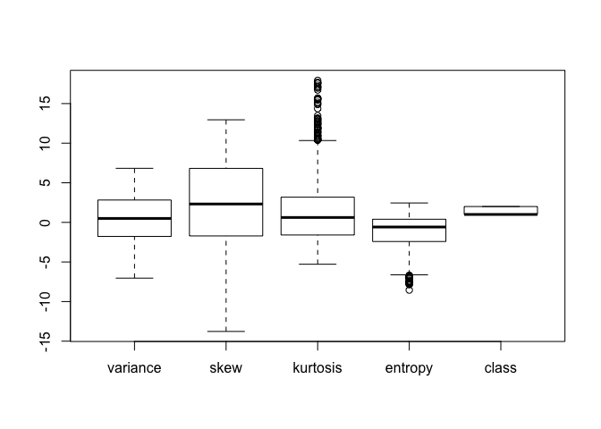
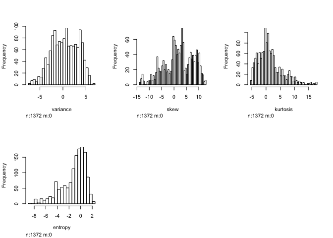

STAT2003\_assignment
================
Amanda Efendi & Nina Kumagai
07/09/2019

``` r
data = read.table("data_banknote_authentication.txt",
                  sep=",",
                  col.names=c("variance", "skew", "kurtosis", "entropy", "class"),
                  fill=FALSE, 
                  strip.white=TRUE)
```

``` r
head(data)
```

    ##   variance    skew kurtosis  entropy class
    ## 1  3.62160  8.6661  -2.8073 -0.44699     0
    ## 2  4.54590  8.1674  -2.4586 -1.46210     0
    ## 3  3.86600 -2.6383   1.9242  0.10645     0
    ## 4  3.45660  9.5228  -4.0112 -3.59440     0
    ## 5  0.32924 -4.4552   4.5718 -0.98880     0
    ## 6  4.36840  9.6718  -3.9606 -3.16250     0

``` r
summary(data)
```

    ##     variance            skew            kurtosis          entropy       
    ##  Min.   :-7.0421   Min.   :-13.773   Min.   :-5.2861   Min.   :-8.5482  
    ##  1st Qu.:-1.7730   1st Qu.: -1.708   1st Qu.:-1.5750   1st Qu.:-2.4135  
    ##  Median : 0.4962   Median :  2.320   Median : 0.6166   Median :-0.5867  
    ##  Mean   : 0.4337   Mean   :  1.922   Mean   : 1.3976   Mean   :-1.1917  
    ##  3rd Qu.: 2.8215   3rd Qu.:  6.815   3rd Qu.: 3.1793   3rd Qu.: 0.3948  
    ##  Max.   : 6.8248   Max.   : 12.952   Max.   :17.9274   Max.   : 2.4495  
    ##      class       
    ##  Min.   :0.0000  
    ##  1st Qu.:0.0000  
    ##  Median :0.0000  
    ##  Mean   :0.4446  
    ##  3rd Qu.:1.0000  
    ##  Max.   :1.0000

``` r
library(dlookr)
```

    ## Registered S3 method overwritten by 'xts':
    ##   method     from
    ##   as.zoo.xts zoo

    ## Registered S3 method overwritten by 'quantmod':
    ##   method            from
    ##   as.zoo.data.frame zoo

    ## Registered S3 methods overwritten by 'car':
    ##   method                          from
    ##   influence.merMod                lme4
    ##   cooks.distance.influence.merMod lme4
    ##   dfbeta.influence.merMod         lme4
    ##   dfbetas.influence.merMod        lme4

    ## 
    ## Attaching package: 'dlookr'

    ## The following object is masked from 'package:base':
    ## 
    ##     transform

``` r
describe_data = describe(data)
```

``` r
str(data)
```

    ## 'data.frame':    1372 obs. of  5 variables:
    ##  $ variance: num  3.622 4.546 3.866 3.457 0.329 ...
    ##  $ skew    : num  8.67 8.17 -2.64 9.52 -4.46 ...
    ##  $ kurtosis: num  -2.81 -2.46 1.92 -4.01 4.57 ...
    ##  $ entropy : num  -0.447 -1.462 0.106 -3.594 -0.989 ...
    ##  $ class   : int  0 0 0 0 0 0 0 0 0 0 ...

``` r
boxplot(data)
```

<!-- -->

``` r
hist(data)
```

<!-- -->
