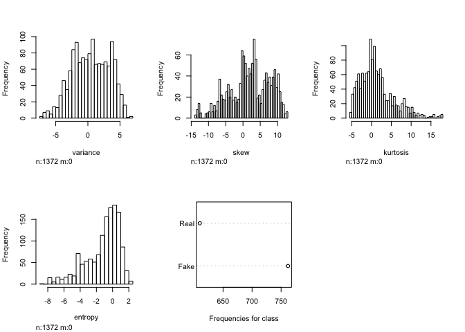

fake-banknotes
================
Amanda Efendi & Nina Kumagai
07/09/2019

# Loading the data

``` r
df = read.table("data_banknote_authentication.txt",
                  sep=",",
                  col.names=c("variance", "skew", "kurtosis", "entropy", "class"),
                  fill=FALSE, 
                  strip.white=TRUE)
```

# Data Wrangling

``` r
head(df)
```

    ##   variance    skew kurtosis  entropy class
    ## 1  3.62160  8.6661  -2.8073 -0.44699     0
    ## 2  4.54590  8.1674  -2.4586 -1.46210     0
    ## 3  3.86600 -2.6383   1.9242  0.10645     0
    ## 4  3.45660  9.5228  -4.0112 -3.59440     0
    ## 5  0.32924 -4.4552   4.5718 -0.98880     0
    ## 6  4.36840  9.6718  -3.9606 -3.16250     0

``` r
summary(df)
```

    ##     variance            skew            kurtosis          entropy       
    ##  Min.   :-7.0421   Min.   :-13.773   Min.   :-5.2861   Min.   :-8.5482  
    ##  1st Qu.:-1.7730   1st Qu.: -1.708   1st Qu.:-1.5750   1st Qu.:-2.4135  
    ##  Median : 0.4962   Median :  2.320   Median : 0.6166   Median :-0.5867  
    ##  Mean   : 0.4337   Mean   :  1.922   Mean   : 1.3976   Mean   :-1.1917  
    ##  3rd Qu.: 2.8215   3rd Qu.:  6.815   3rd Qu.: 3.1793   3rd Qu.: 0.3948  
    ##  Max.   : 6.8248   Max.   : 12.952   Max.   :17.9274   Max.   : 2.4495  
    ##      class       
    ##  Min.   :0.0000  
    ##  1st Qu.:0.0000  
    ##  Median :0.0000  
    ##  Mean   :0.4446  
    ##  3rd Qu.:1.0000  
    ##  Max.   :1.0000

``` r
library(dlookr)
```

    ## Registered S3 method overwritten by 'xts':
    ##   method     from
    ##   as.zoo.xts zoo

    ## Registered S3 method overwritten by 'quantmod':
    ##   method            from
    ##   as.zoo.data.frame zoo

    ## Registered S3 methods overwritten by 'car':
    ##   method                          from
    ##   influence.merMod                lme4
    ##   cooks.distance.influence.merMod lme4
    ##   dfbeta.influence.merMod         lme4
    ##   dfbetas.influence.merMod        lme4

    ## 
    ## Attaching package: 'dlookr'

    ## The following object is masked from 'package:base':
    ## 
    ##     transform

``` r
describe_data = describe(df)
```

``` r
#Change class to factor
df$class <- as.factor(df$class); str(df)
```

    ## 'data.frame':    1372 obs. of  5 variables:
    ##  $ variance: num  3.622 4.546 3.866 3.457 0.329 ...
    ##  $ skew    : num  8.67 8.17 -2.64 9.52 -4.46 ...
    ##  $ kurtosis: num  -2.81 -2.46 1.92 -4.01 4.57 ...
    ##  $ entropy : num  -0.447 -1.462 0.106 -3.594 -0.989 ...
    ##  $ class   : Factor w/ 2 levels "0","1": 1 1 1 1 1 1 1 1 1 1 ...

``` r
#Rename the levels of class
levels(df$class) <- c("Fake", "Real"); str(df)
```

    ## 'data.frame':    1372 obs. of  5 variables:
    ##  $ variance: num  3.622 4.546 3.866 3.457 0.329 ...
    ##  $ skew    : num  8.67 8.17 -2.64 9.52 -4.46 ...
    ##  $ kurtosis: num  -2.81 -2.46 1.92 -4.01 4.57 ...
    ##  $ entropy : num  -0.447 -1.462 0.106 -3.594 -0.989 ...
    ##  $ class   : Factor w/ 2 levels "Fake","Real": 1 1 1 1 1 1 1 1 1 1 ...

# EDA on Data

``` r
boxplot(df)
```

<!-- -->

``` r
hist(df)
```

<!-- -->

``` r
library(DataExplorer)
```

# Attempt to Split (?) - ask Ritu for confirmation

``` r
# set.seed(7)
# ss <- sample(1:3,size=nrow(df),replace=TRUE,prob=c(0.333,0.333,0.333))
# sample1 <- df[ss==1,]
# sample2 <- df[ss==2,]
# sample3 <- df[ss==3,]
```

``` r
# str(sample1)
# str(sample2)
# str(sample3)
```

``` r
# sample_size <- nrow(df)
# set_proportions <- c(Training = 0.33, Validation = 0.33, Test = 0.33)
# set_frequencies <- diff(floor(sample_size * cumsum(c(0, set_proportions))))
# df$set <- sample(rep(names(set_proportions), times = set_frequencies))
```

# SPLIT INTO TEST AND TRAINING

``` r
set.seed(1234)
TestIndex = sample((nrow(df)), floor(0.15*nrow(df)))
testing <- df[TestIndex,]
training <- df[-TestIndex,]; str(training)
```

    ## 'data.frame':    1167 obs. of  5 variables:
    ##  $ variance: num  3.622 4.546 3.866 0.329 4.368 ...
    ##  $ skew    : num  8.67 8.17 -2.64 -4.46 9.67 ...
    ##  $ kurtosis: num  -2.81 -2.46 1.92 4.57 -3.96 ...
    ##  $ entropy : num  -0.447 -1.462 0.106 -0.989 -3.163 ...
    ##  $ class   : Factor w/ 2 levels "Fake","Real": 1 1 1 1 1 1 1 1 1 1 ...

# MACHINE LEARNING ALGORITHMS

## TREATMENT: Level 1 Logistic Regression

``` r
library(pROC)
```

    ## Type 'citation("pROC")' for a citation.

    ## 
    ## Attaching package: 'pROC'

    ## The following objects are masked from 'package:stats':
    ## 
    ##     cov, smooth, var

``` r
glm = glm(class ~ . , data = training, family = binomial(link="logit"))
```

    ## Warning: glm.fit: fitted probabilities numerically 0 or 1 occurred

``` r
summary(glm)
```

    ## 
    ## Call:
    ## glm(formula = class ~ ., family = binomial(link = "logit"), data = training)
    ## 
    ## Deviance Residuals: 
    ##      Min        1Q    Median        3Q       Max  
    ## -1.54867   0.00000   0.00000   0.00016   2.35867  
    ## 
    ## Coefficients:
    ##             Estimate Std. Error z value Pr(>|z|)    
    ## (Intercept)   7.2479     1.6986   4.267 1.98e-05 ***
    ## variance     -8.4998     2.0783  -4.090 4.32e-05 ***
    ## skew         -4.5225     1.0889  -4.153 3.28e-05 ***
    ## kurtosis     -5.7002     1.3859  -4.113 3.91e-05 ***
    ## entropy      -0.8738     0.3921  -2.228   0.0259 *  
    ## ---
    ## Signif. codes:  0 '***' 0.001 '**' 0.01 '*' 0.05 '.' 0.1 ' ' 1
    ## 
    ## (Dispersion parameter for binomial family taken to be 1)
    ## 
    ##     Null deviance: 1604.817  on 1166  degrees of freedom
    ## Residual deviance:   42.229  on 1162  degrees of freedom
    ## AIC: 52.229
    ## 
    ## Number of Fisher Scoring iterations: 12

``` r
pred.glm = predict(glm, newdata=testing, type='response')
pred.glmclass = rep("Fake", length(pred.glm))
pred.glmclass[pred.glm>0.5] = "Real"

table(pred.glmclass, testing$class, dnn=c("Predictions","Actual"))
```

    ##            Actual
    ## Predictions Fake Real
    ##        Fake  117    3
    ##        Real    0   85

``` r
# Probability of success???? 0.9854
(117+85)/(117+85+3)
```

    ## [1] 0.9853659

**Logistic Regression** probability of success is 0.9853

``` r
par(pty='s')
plot(roc(testing$class, pred.glm), legacy.axes=TRUE)
```

    ## Setting levels: control = Fake, case = Real

    ## Setting direction: controls < cases

<!-- -->

## TREATMENT: Level 2 Linar Discriminant Analysis

*insert codes here*

## TREATMENT: Level 3 Classification and Regression Trees

``` r
library(rpart)
rpart = rpart(class ~ ., data = training)
plot(rpart)
text(rpart)
```

<!-- -->

``` r
library(partykit)
```

    ## Loading required package: grid

    ## Loading required package: libcoin

    ## Loading required package: mvtnorm

``` r
plot(as.party(rpart))
```

<!-- -->

``` r
rpart.pred = predict(rpart, newdata = testing, type = "class")
table(rpart.pred, testing$class, dnn = c("Prediction", "Actual"))
```

    ##           Actual
    ## Prediction Fake Real
    ##       Fake  108   11
    ##       Real    9   77

``` r
# Probability of Success
(108+77)/(108+77+11+9)
```

    ## [1] 0.902439

## TREATMENT: Level 4 Naive Bayes

``` r
library(e1071)
```

``` r
nb =naiveBayes(class ~ ., data=training)
print(nb)
```

    ## 
    ## Naive Bayes Classifier for Discrete Predictors
    ## 
    ## Call:
    ## naiveBayes.default(x = X, y = Y, laplace = laplace)
    ## 
    ## A-priori probabilities:
    ## Y
    ##      Fake      Real 
    ## 0.5526992 0.4473008 
    ## 
    ## Conditional probabilities:
    ##       variance
    ## Y           [,1]     [,2]
    ##   Fake  2.252449 2.030875
    ##   Real -1.869254 1.865284
    ## 
    ##       skew
    ## Y           [,1]     [,2]
    ##   Fake  4.073640 5.130576
    ##   Real -1.076443 5.480462
    ## 
    ##       kurtosis
    ## Y           [,1]     [,2]
    ##   Fake 0.9349419 3.229933
    ##   Real 2.2073168 5.339396
    ## 
    ##       entropy
    ## Y           [,1]     [,2]
    ##   Fake -1.080787 2.079297
    ##   Real -1.278602 2.050263

``` r
printALL=function(model){
  trainPred=predict(model, newdata = training, type = "class")
  trainTable=table(training$class, trainPred)
  testPred=predict(nb, newdata=testing, type="class")
  testTable=table(testing$class, testPred)
  trainAcc=(trainTable[1,1]+trainTable[2,2])/sum(trainTable)
  testAcc=(testTable[1,1]+testTable[2,2])/sum(testTable)
  message("Contingency Table for Training Data")
  print(trainTable)
  message("Contingency Table for Test Data")
  print(testTable)
  message("Accuracy")
  print(round(cbind(trainAccuracy=trainAcc, testAccuracy=testAcc),3))
}
printALL(nb)
```

    ## Contingency Table for Training Data

    ##       trainPred
    ##        Fake Real
    ##   Fake  563   82
    ##   Real  108  414

    ## Contingency Table for Test Data

    ##       testPred
    ##        Fake Real
    ##   Fake  108    9
    ##   Real   23   65

    ## Accuracy

    ##      trainAccuracy testAccuracy
    ## [1,]         0.837        0.844

A more simple and elegant method?

``` r
library(naivebayes)
```

    ## naivebayes 0.9.6 loaded

``` r
new_nb = naive_bayes(class ~ .,usekernel=T, data=training)
printALL(new_nb)
```

    ## Warning: predict.naive_bayes(): More features in the newdata are provided
    ## as there are probability tables in the object. Calculation is performed
    ## based on features to be found in the tables.

    ## Contingency Table for Training Data

    ##       trainPred
    ##        Fake Real
    ##   Fake  614   31
    ##   Real   49  473

    ## Contingency Table for Test Data

    ##       testPred
    ##        Fake Real
    ##   Fake  108    9
    ##   Real   23   65

    ## Accuracy

    ##      trainAccuracy testAccuracy
    ## [1,]         0.931        0.844

## TREATMENT: Level 5 Support Vector Machines

``` r
plot(training)
```

<!-- -->

``` r
# Fitting SVM to the Training set 
library(e1071) 
  
svm_fit = svm(formula = class ~ ., 
                 data = training, 
                 type = 'C-classification', 
                 kernel = 'linear') 
```

``` r
svm_pred = predict(svm_fit, newdata = testing) 
```

``` r
cm = table(testing[,5], svm_pred) 
cm
```

    ##       svm_pred
    ##        Fake Real
    ##   Fake  116    1
    ##   Real    0   88

``` r
plot(svm_fit, training, variance ~ skew)
```

<!-- -->

``` r
plot(svm_fit, training, kurtosis ~ entropy)
```

<!-- -->

``` r
# # installing library ElemStatLearn 
# library(ElemStatLearn) 
#   
# # Plotting the training data set results 
# set = training
# X1 = seq(min(set[, 1]) - 1, max(set[, 1]) + 1, by = 0.01) 
# X2 = seq(min(set[, 2]) - 1, max(set[, 2]) + 1, by = 0.01) 
# # X3 = seq(min(set[, 3]) - 1, max(set[, 3]) + 1, by = 0.01) 
# # X4 = seq(min(set[, 4]) - 1, max(set[, 4]) + 1, by = 0.01) 
#   
# grid_set = expand.grid(X1, X2) 
# colnames(grid_set) = c('variance', 'skew') 
# y_grid = predict(svm, newdata = grid_set) 
#   
# plot(set[, -3:-5], 
#      main = 'SVM (Training set)', 
#      xlab = 'variance', ylab = 'skew', 
#      xlim = range(X1), ylim = range(X2)) 
#   
# contour(X1, X2, matrix(as.numeric(y_grid), length(X1), length(X2)), add = TRUE) 
#   
# points(grid_set, pch = '.', col = ifelse(y_grid == 1, 'coral1', 'aquamarine')) 
#   
# points(set, pch = 21, bg = ifelse(set[, 3] == 1, 'green4', 'red3')) 
```
